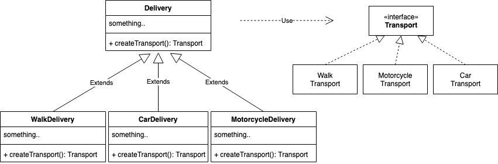

# Factory Method
Factory Method는 superclass에서 객체를 생성하기 위한 인터페이스를 제공하고, subclass에서 생성 될 객체의 유형을 변경할 수 있도록 하는 디자인 패턴이다.

## 사용 시나리오 예시 
배달 어플리케이션을 만든다고 가정해보자.  
처음에는 배달을 항상 오토바이로만 했기 때문에 `motorcycle`이라는 클래스를 만들어서 관리하였다. 

운이 좋게 배달이 잘 되어서 이제는 오토바이 뿐만 아니라 킥보드, 자동차, 뚜벅이 등의 배달방법이 생겨났다.   
하지만, 기존에 배달방법을 `motocycle`로만 한정되어있기 때문에 수정이 필요하다.  

Factory Method 패턴을 이용한 예시를 나타낸다.  
먼저 subclass들에 의해 생성될 공통적인 인터페이스인 `Transport`를 선언한다.  
그리고나서 `Delivery` 클래스를 상속하는 subclass들(WalkDelivery, CarDelivery, MotocycleDelivery)을 만들어주고 `createTransport()`에서 각자 맞는 `Transport`객체를 리턴하게 한다.  
예를 들어, `WalDelivery`는 `WalkTransport`인스턴스를 리턴하게 될 것이다.  
Factory Method (여기서는 createTransport)는 항상 새로운 인스턴스를 리턴할 필요는 없다. 인스턴스 풀이나 기존에 존재하는 인스턴스를 리턴하게 해도 된다.  

## 언제 사용하는지

- 작업해야 하는 객체의 타입이나 의존성(dependency)를 미리 알 수 없을 때 사용하면 좋다.  
- 라이브러리나 프레임워크의 사용자에게 내부 컴포넌트를 확장하는 방법을 제공할 때 사용하면 좋다.
  위의 예시에서 `transport` 인터페이스를 구현하고 `Delivery`를 상속하는 새로운 subclass를 만들게 하면 된다.

## 장단점
### 장점

- 인스턴스 생성자(예제에서 Delivery)와 인스턴스(예제에서 Transport)의 decoupling
- Single Responsibility 원칙. 인스턴스 생성코드를 분리하여 코드 관리가 더 쉽다.
- Open/Closed 원칙. 기존의 클라이언트 코드를 수정하지 않고도 새로운 타입의 인스턴스를 제공할 수 있다. 

### 단점

- 매번 새로운 subclass를 구현해야하기 때문에 코드가 길어지거나 복잡해질 수 있다.

## 구현 
